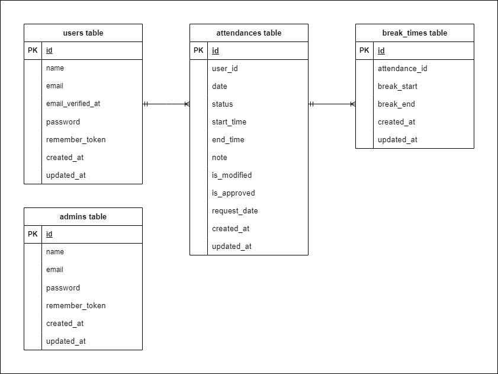

# coachtech 勤怠管理アプリ

## 概要
このプロジェクトは、Laravelを使用した勤怠管理アプリです。  
Dockerを利用した環境構築が可能で、MySQLデータベースを使用しています。  
ユーザー登録、ログイン、打刻、勤怠の閲覧・修正申請、管理者による承認機能など、勤怠管理アプリに必要な基本機能を実装しています。

## 環境構築

### **Dockerビルド**

1. リポジトリをクローン
   ```bash
   git clone git@github.com:mmisa33/attendance-management-app.git
2. プロジェクトフォルダに移動
    ```bash
    cd attendance-management-app
3. Dockerコンテナをビルドして起動
    ```bash
    docker-compose up -d --build
> **⚠ 注意**  
> MySQLはOSによって起動しない場合があるので、それぞれのPCに合わせて `docker-compose.yml` ファイルを編集してください。

### **Laravel環境構築**

1. PHPコンテナに入る
   ```bash
    docker-compose exec php bash
2. 必要な依存関係をインストール
    ```bash
    composer install
3. .env.example ファイルから .env を作成
    ```bash
    cp .env.example .env
4. .env ファイルの環境変数を変更
    ```bash
    # データベース設定
    DB_CONNECTION=mysql
    DB_HOST=mysql
    DB_PORT=3306
    DB_DATABASE=laravel_db
    DB_USERNAME=laravel_user
    DB_PASSWORD=laravel_pass

    # MailHog設定（開発用メール確認ツール）
    MAIL_MAILER=smtp
    MAIL_HOST=mailhog
    MAIL_PORT=1025
    MAIL_USERNAME=null
    MAIL_PASSWORD=null
    MAIL_ENCRYPTION=null
    MAIL_FROM_ADDRESS=no-reply@example.com
    MAIL_FROM_NAME="AttendanceManagementApp"
5. アプリケーションキーを生成
   ```bash
   php artisan key:generate
6. データベースをマイグレーション
   ```bash
   php artisan migrate
7. データベースに初期データを挿入
   ```bash
   php artisan db:seed
   ```
    > **💡 補足**
    > - `AdminsTableSeeder` は、アプリの動作に必須の管理者データを挿入するため、**必ず実行が必要**です。
    > - `UsersTableSeeder` や `AttendancesTableSeeder` など、その他のシーダーは、アプリを実際に使用しているように見せる**サンプルデータ**を挿入します。
    > - 本番環境では `AdminsTableSeeder` のみを使い、他は開発やテスト時に利用することを想定しています。

## サンプルアカウント（ログイン用）

本アプリには、`UsersTableSeeder`にあらかじめメール認証済みのログイン用ユーザーが5名、及び管理者が1名登録されています。  
開発時や動作確認にご利用ください。

- ユーザー用ログインURL：[http://localhost/login](http://localhost/login)
- 管理者用ログインURL：[http://localhost/admin/login](http://localhost/admin/login)

### 🔐 サンプルユーザー情報

 - **島 裕子**
   - Email: `shima@example.com`
   - Password: `password123`
 - **佐々木 蓮**
   - Email: `sasaki@example.com`
   - Password: `password123`
 - **山田 太郎**
   - Email: `yamada@example.com`
   - Password: `password123`
 - **鈴木 次郎**
   - Email: `suzuki@example.com`
   - Password: `password123`
 - **中村 加奈子**
   - Email: `nakamura@example.com`
   - Password: `password123`

### 🔐 サンプル管理者情報

 - **管理者**
   - Email: `admin@example.com`
   - Password: `password123`

## 使用技術
- PHP 7.4.9
- Laravel 8.83.8
- MySQL 10.3.39 (MariaDB)
- Laravel Fortify（ユーザー認証機能）
- MailHog（ローカル環境におけるメール送信確認ツール）

## テスト
本アプリでは、**PHPUnit** を用いた自動テストを導入しています。  
実装された機能ごとに、主要なユースケースを想定したテストケースを用意しており、品質の担保を目的としています。

- Laravelの`RefreshDatabase`トレイトを活用し、テスト実行ごとにクリーンな状態で検証を実施
- テストはすべて**案件シート＜テストケース一覧＞**に記載された要件をもとに作成

### **テスト実行**

1. PHPコンテナに入る
   ```bash
   docker-compose exec php bash
2. マイグレーションをリセットし、再実行
    ```bash
    php artisan migrate:refresh --seed
3. テストを実行
    ```bash
    php artisan test
   ```
    > **💡 補足**
    > - `php artisan migrate:refresh --seed`は、マイグレーションをリセットし、再実行するコマンドです。テスト実行前に、クリーンなデータベース状態を整えるために必要です。  
    > - テスト実行後、データベースの状態が変更される可能性があるため、再度テストを実行する際には上記の手順を繰り返してください。

## ER図


## URL
- 開発環境： [http://localhost/](http://localhost/)
- phpMyAdmin： [http://localhost:8080/](http://localhost:8080/)
- MailHog（開発用メール確認ツール）： [http://localhost:8025/](http://localhost:8025/)